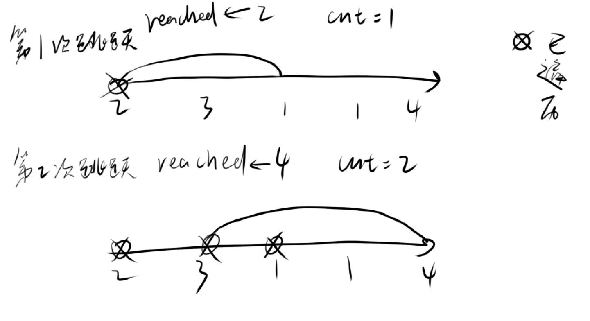

# 45、跳跃游戏2
维护两个变量res、reached分别表示需要跳跃的次数以及总体所能到达的最远距离，接着开始遍历，对于每一次遍历，首先记录下次跳跃前所能到达的最远距离ed，然后遍历这段距离，遍历过程中不断更新reached，这段距离遍历之后，res++，并判断reached能否越过终点，若能，则
return res



C++
```cpp
class Solution {
public:
    int jump(vector<int>& nums) {
        if (nums.size() == 1) return 0;
        int cnt = 0;
        int reached = 0;
        for (int i = 0; i <= reached; i ++ ) {
            int ed = reached;
            for (int j = i; j <= ed; j ++ ) {
                reached = max(reached, nums[j] + j);
            }
            cnt ++ ;
            if (reached >= nums.size() - 1) return cnt;
        }
        return 0;
    }
};
```
