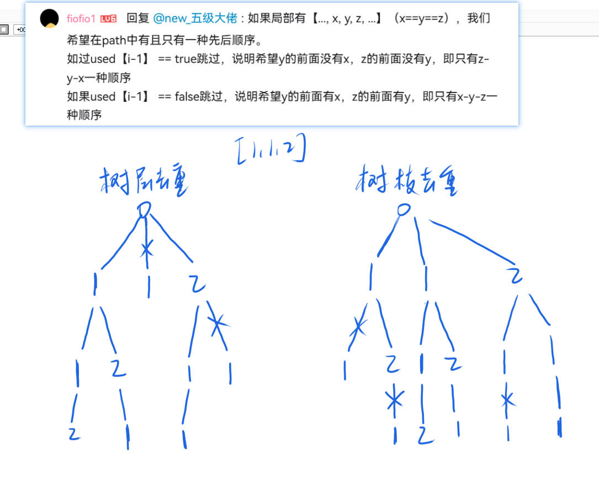

# 47、全排列2
在46、全排列的基础上，添加了树层去重**树枝去重**，注意这两种去重都可以，具体原因，可以参考：


C++
```cpp
class Solution {
public:
    vector<vector<int>> res;
    vector<int> path;
    vector<bool>used;
    void dfs(vector<int>&nums, vector<bool>used) {
        if (path.size() == nums.size()) {
            res.push_back(path);
            return;
        }
        for (int i = 0; i < nums.size(); i ++ ) {
            if (used[i] == true) continue;
            if (i > 0 && nums[i - 1] == nums[i] && used[i - 1] == true) continue;
            used[i] = true;
            path.push_back(nums[i]);
            dfs(nums, used);
            used[i] = false;
            path.pop_back();
        }
    }
    vector<vector<int>> permuteUnique(vector<int>& nums) {
        sort(nums.begin(), nums.end());
        used = vector<bool>(nums.size(), false);
        dfs(nums, used);
        return res;
    }
};
```
