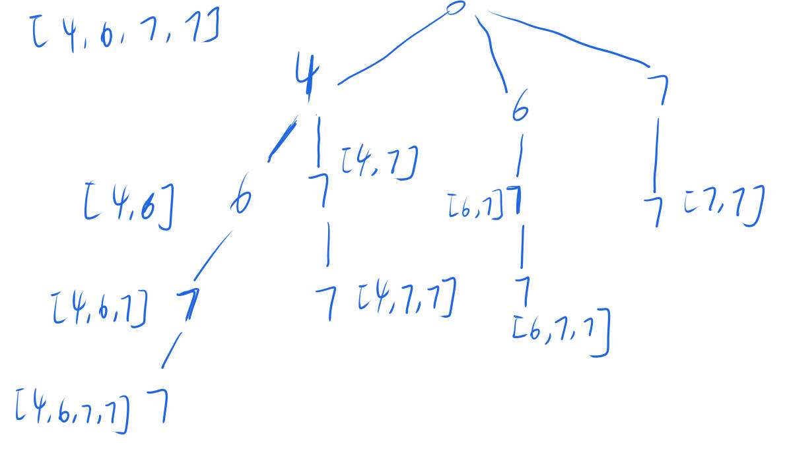

# 491、非递减子序列
前提知识：[leetcode90.子集2](./leetcode90.子集2.md)

本题在此基础上，加入树层去重，只不过由于nums是无法排序的，因此需要使用unordered_set进行去重，而且为了方便最好是在每个结点处都要创建一个unordered_set

一个例子的递归树如下图所示


```cpp
class Solution {
private:
    vector<vector<int>> res;
    vector<int> path;
    void dfs(vector<int>& nums, int startIndex) {
        if (path.size() > 1) {
            res.push_back(path);
        }
        unordered_set<int> used;
        for (int i = startIndex; i < nums.size(); i ++ ) {
            if ((!path.empty() && path.back() > nums[i]) || used.contains(nums[i])) continue;
            used.insert(nums[i]);
            path.push_back(nums[i]);
            dfs(nums, i + 1);
            path.pop_back();
        }
    }
public:
    vector<vector<int>> findSubsequences(vector<int>& nums) {
        res.clear();
        path.clear();
        dfs(nums, 0);
        return res;
    }
};
```
