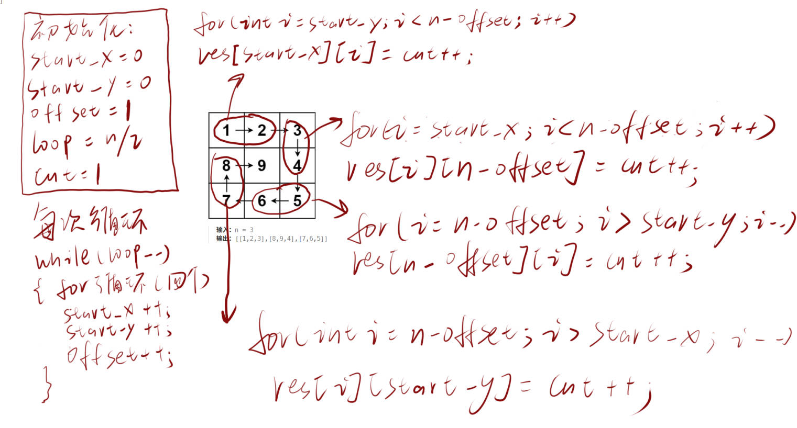

# 59、螺旋矩阵2
题目网址：https://leetcode.cn/problems/spiral-matrix-ii/

题目难度：mid

代码语言：cpp
## 题解
按照下图进行遍历即可


**代码**

C++

```cpp
class Solution {
public:
    vector<vector<int>> generateMatrix(int n) {
        int loop = n / 2;
        int start_x = 0;
        int start_y = 0;
        int offset = 1;
        int cnt = 1;
        vector<vector<int>> res(n, vector<int>(n, 0));
        while (loop -- ){
            for (int i = start_y; i < n - offset; i ++ ) res[start_x][i] = cnt ++ ;
            for (int i = start_x; i < n - offset; i ++ ) res[i][n - offset] = cnt ++ ;
            for (int i = n - offset; i > start_y; i -- ) res[n - offset][i] = cnt ++ ;
            for (int i = n - offset; i > start_x; i -- ) res[i][start_y] = cnt ++ ;
            start_x ++ ;
            start_y ++ ;
            offset ++ ;
        }
        if (n % 2 == 1) res[n / 2][n / 2] = cnt ++ ;
        return res;
    }
};
```
