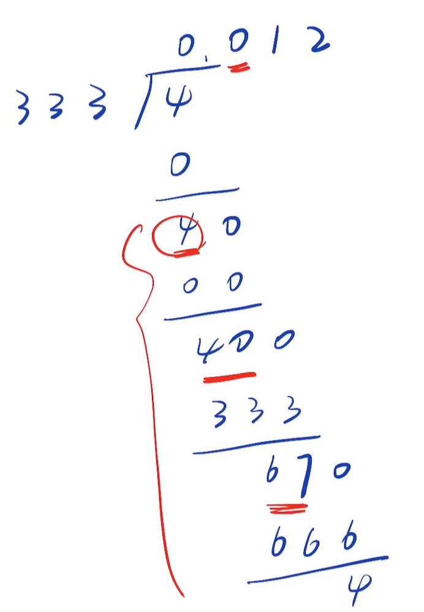

# 166、分数到小数
难度：mid

代码语言：cpp

题目网址：https://leetcode.cn/problems/fraction-to-recurring-decimal/description/

## 解法
### 方法一、模拟
思路来源：[【LeetCode 每日一题】166. 分数到小数 | 手写图解版思路 + 代码讲解](https://www.bilibili.com/video/BV14e4y1C75R/?spm_id_from=333.337.search-card.all.click&vd_source=5a9892c5685e5b7e1d5cbd33baa8869e)

我们把小数的整数部分和小数部分分开来看，整数部分直接让分子整除以分母即可得到，下面重点来说小数部分。

下图展示了除法的整个过程，我们可以记录每一次除法得到的余数，如果某次得到新余数之前已经记录过了，说明就开始了新一轮的循环，我们就在这一段的商两边加上括号表示无限循环，具体地，可以结合下图看代码注释进行理解



最后需要注意，在计算之前要把分子和分母转换为long long类型，为什么？举一个例子，分子是$`-2^{31}`$，分母是-1，那么最终得到的小数$`2^{31}`$超出了int的表示范围

## 代码
C++

```cpp
class Solution {
public:
    string fractionToDecimal(int numerator, int denominator) {
        //记录最终的答案
        string ans;
        //转换为long long防止溢出
        long long x = numerator, y = denominator;
        //如果可以整除，直接返回整数形式的字符串即可
        if (x % y == 0) return to_string(x / y);
        //如果一正一负，结果为负值，先在ans最前面加上负号
        if ((x < 0) ^ (y < 0)) ans += '-';
        //为了方便，将x，y转换为绝对值形式，不用再考虑正负的处理
        x = abs(x), y = abs(y);
        //x是第一个余数
        ans += to_string(x / y) + '.', x %= y;
        //记录余数在字符串中的位置，方便插入左括号
        unordered_map<long long, int> pos;
        while (x) {
            //记录当前余数在ans中的位置
            pos[x] = ans.length();
            //将余数乘以十，进行后续的计算（对应图中的4-->40  40-->400 67-->670...）
            x *= 10;
            //记录新的商（对应图中的0、1、2...）
            ans += to_string(x / y);
            //计算新的余数（对应图中的40、67...）
            x %= y;
            //如果新的余数之前已经记录过，说明开始了新一轮的小数循环
            if (pos.count(x)) {
                //在循环开始位置前插入左括号（图中是在0左边插入了左括号）
                ans.insert(pos[x], "(");
                //在字符串最右边插入右括号（图中是在2的右边插入了右括号）
                ans += ')';
                break;
            }
        }
        return ans;
    }
};
```
