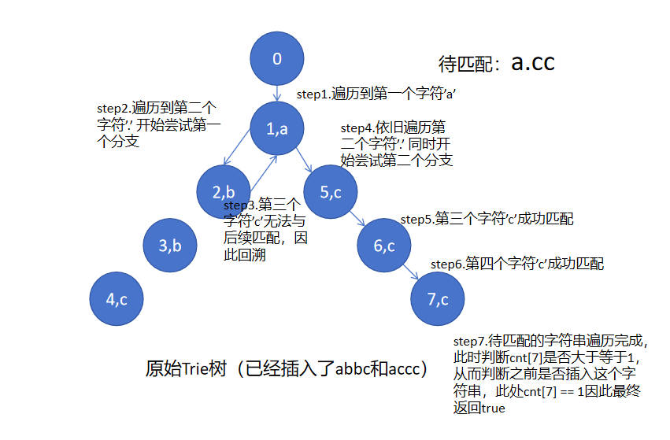

# 211、添加与搜索单词-数据结构设计
题目难度：mid

题目网址：https://leetcode.cn/problems/design-add-and-search-words-data-structure/

代码语言：cpp
## 题解
### 方法一、Trie
前置知识：Trie

Trie的写法参考：[acwing835. Trie字符串统计](https://www.acwing.com/problem/content/837/)

这道题相较于相较于常规的前缀树Trie，在查询时多了一个通配符.的问题，当遇到通配符时，我们可以遍历该工作指针p下的所有分支，如果其中一个匹配成功，那么就返回true，如果全部匹配失败，则返回false

举一个例子，假如我们的前缀树已经插入了abbc和accc两个字符串，现在我们要匹配一个a.cc，当遍历到下标为1的'.'时，工作指针p指向前缀树中的'a'，此时p指向的结点有两个分支，一个分支是b结点，一个分支是c结点，我们只需要依次遍历
这两个分支，对于第一个分支，我们将工作指针指向b（abbc的第二个字符），然后进行递归，继续匹配`a.cc`的'cc'能否与abbc的后两个字符匹配，发现匹配失败。因此回溯到第二个分支，工作指针指向c（accc的第二个字符），然后进行递归，
继续匹配`a.cc`的'cc'能否与accc的后两个字符匹配，发现匹配成功，因此最终返回true，具体过程可以看下图：



C++

```cpp
class WordDictionary {
private:
    static const int N = 10010 * 25;
    int son[N][26], cnt[N], idx;
public:
    WordDictionary() {
        idx = 0;
        memset(son, 0, sizeof son);
        memset(cnt, 0, sizeof cnt);
    }
    
    void addWord(string word) {
        int p = 0;
        for (int i = 0; i < word.size(); i ++ ) {
            int u = word[i] - 'a';
            if (!son[p][u]) son[p][u] = ++ idx;
            p = son[p][u];
        }
        cnt[p] ++ ;
    }
    
    bool search(string word) {
        return find(word, 0);
    }

    bool find(string word, int p) {
        for (int i = 0; i < word.size(); i ++ ) {
            if (word[i] == '.') {
                for (int j = 0; j < 26; j ++ ) {
                    if (!son[p][j]) continue;
                    if (find(word.substr(i + 1), son[p][j])) return true;
                }
                return false;
            } else {
                int u = word[i] - 'a';
                if (!son[p][u]) return false;
                p = son[p][u];
            }  
        }
        if (cnt[p] >= 1) return true;
        else return false;
    }
};

/**
 * Your WordDictionary object will be instantiated and called as such:
 * WordDictionary* obj = new WordDictionary();
 * obj->addWord(word);
 * bool param_2 = obj->search(word);
 */
```
