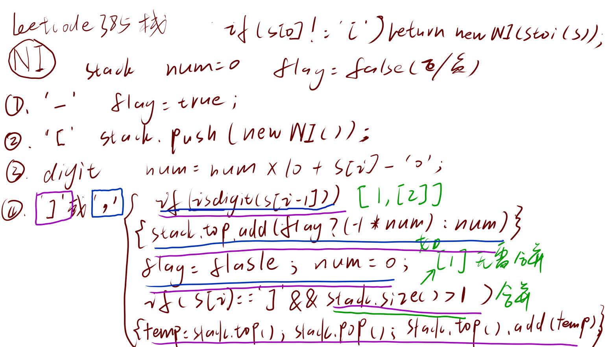

# 385、迷你语法分析器
题目网址：https://leetcode.cn/problems/mini-parser/description/

题目难度：mid

代码语言：cpp
## 题解
### 方法一、栈
这虽然是一个冷门题目，但是是一道经典的模拟栈的题，类似于经典的表达式求值问题，但个人感觉比它要难以理解或者说细节要多一点，具体地分类讨论见下图和代码


**代码**

C++

```cpp
/**
 * // This is the interface that allows for creating nested lists.
 * // You should not implement it, or speculate about its implementation
 * class NestedInteger {
 *   public:
 *     // Constructor initializes an empty nested list.
 *     NestedInteger();
 *
 *     // Constructor initializes a single integer.
 *     NestedInteger(int value);
 *
 *     // Return true if this NestedInteger holds a single integer, rather than a nested list.
 *     bool isInteger() const;
 *
 *     // Return the single integer that this NestedInteger holds, if it holds a single integer
 *     // The result is undefined if this NestedInteger holds a nested list
 *     int getInteger() const;
 *
 *     // Set this NestedInteger to hold a single integer.
 *     void setInteger(int value);
 *
 *     // Set this NestedInteger to hold a nested list and adds a nested integer to it.
 *     void add(const NestedInteger &ni);
 *
 *     // Return the nested list that this NestedInteger holds, if it holds a nested list
 *     // The result is undefined if this NestedInteger holds a single integer
 *     const vector<NestedInteger> &getList() const;
 * };
 */
class Solution {
public:
    NestedInteger deserialize(string s) {
        if (s[0] != '[') return NestedInteger(stoi(s));
        stack<NestedInteger> st;
        int num = 0;
        bool flag = false;
        for (int i = 0; i < s.length(); i ++ ) {
            if (s[i] == '[') st.push(NestedInteger());
            else if (s[i] == '-') flag = true;
            else if (isdigit(s[i])) num = num * 10 + s[i] - '0';
            else if (s[i] == ',') {
                if (isdigit(s[i - 1])) st.top().add(flag ? (-1 * num) : num);//当类似[[1,2],1]逗号前是右括号时，没有数字需要加入
                num = 0, flag = false;//重新初始化
            }
            else if (s[i] == ']') {
                if (isdigit(s[i - 1])) st.top().add(flag ? (-1 * num) : num);//当类似[1,[1,2]]连续两个右括号时，没有数字需要加入
                num = 0, flag = false;//重新初始化
                if (st.size() > 1) {
                    auto temp = st.top();
                    st.pop();
                    st.top().add(temp);//合并，但是当类似[1]栈中只有一个元素时，无需合并
                }
            }
        }
        return st.top();
    }
};
```
